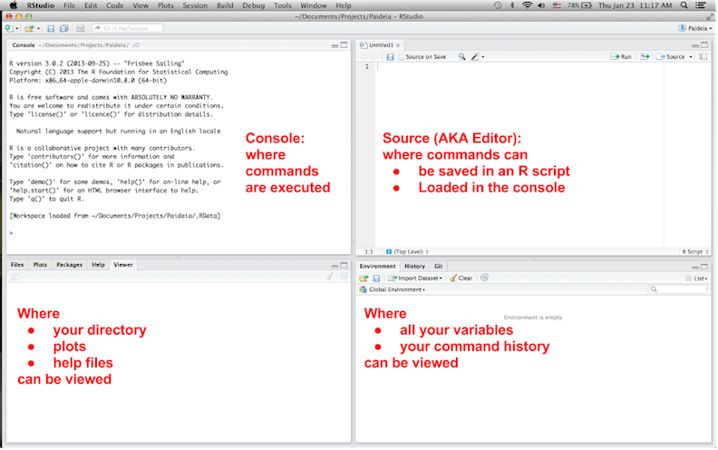

## Set-Up

* Go to [github.com/majerus/paideia_reed_college/R_for_beginners](https://github.com/majerus/paideia_reed_college/R_for_beginners) 
    + Unzip paideia.zip
    + Open `slides.html`
* Open RStudio:
    + Open a Finder window
    + Then click on Applications > RStudio

## R and R Studio

* R is statistical software that is command-line based. It has its own default interface.
* RStudio is a program which IMO has a more intuitive and user friendly interface.

## Why and why not use R?

Like getting under hood of a car!

## Why not use R
In increasing order of relevance:

* Can get slow
* Unstructured technical help: mostly online
* Requires programming knowledge
* It is not point and click software
* Steep learning curve

## Why use R
In increasing order of relevance:

* Open source
* People can contribute extensions called packages to R from statistics, biology, economics, social sciences, political science, etc.
* Free!

## RStudio

## Structure of this class

* "Learn by doing"
* Feel free to run ahead
* Important topics will be covered as we go
* We are only getting you started

## Console + R scripts

* **Console Window**: is where you run/execute commands.  The `>` is the prompt; it means R is ready to receive commands.  If you don’t see a `>` and want to restart, press ESC.
* **R Script Window**:  You can edit and save your files here.

## Three important keyboard shortcuts

1. **Tab**:  complete command and variable names
2. (From console) **Up**:  scroll thru previous commands
3. (From editor) **CMD+Enter** or **Control+Enter**:  execute in console either current line or highlighted code

## Learn by doing #0
Your turn. Open `Paideia.R` in RStudio

## Topics covered

* Difference between R console and R scripts
* Comments: it’s good practice to include them
* Variables and how to assign them
* Vectors and matrices
* Functions and their arguments
* Help files

## Learn by doing #1

**Questions**

* Did students who handed in their final exams earlier do better?
* Did the final exam grade vary much by major?

**Data**:  for each student who took MATH 141 Intro to Prob & Stats in Fall 2013

* Exam score
* Time to submission
* Major (3 categories):  Econ, Bio, Rest

Data is saved in Comma Separated Value (CSV) file format. 

## Topics covered

* Open your Excel/OpenOffice spreadsheet and save as CSV
* Import CSV into R
* Exploratory data analysis on numerical variables:  summary statistics and basic visualizations

## Learn by doing #2
**Question**:  What did the San Francisco OkCupid online dating pool look like in June 2012?

* What were the users sex and sexual orientation?
* How tall were they?  Then split by male and female.

## Learn by doing #2

**Data**:  This is the result of a Python script that scraped the OkCupid website.  We consider the n=59,946 users who were

* members on 2012/06/26
* within 25 miles of SF
* online in the last year
* have at least one photo
Their public profiles were pulled on 2012/06/30.  i.e. only data that’s visible to the public

## Topics covered

* How to do basic exploratory data analysis on categorical variables
    + `table()` to get frequency counts
    + make basic visualizations: barplots and mosaicplots
* How to make histograms of numerical data
* How to get subsets of data, e.g. only men vs only women.

## Learn by doing #3

**Question**:  Who will people who attend my goodbye party know?

**Data**:  41 x 41 matrix of `TRUE`/`FALSE`s indicating for all pairs of people if I think they know each other.

**Tool**:  We will use the network package to create a visual social network graph, contributed by a team of sociologists and statisticians.

## Rules for social network graph

* Couples are Brangelina'ed into single units
* Bubble sizes are proportional to log(# of the people the person knows)
* I'm included at the center for two reasons:  1) raging narcissism & 2) graph aesthetics

## Topics covered

* How to install and load an R package
* How to export a plot to .png format

## Topics we didn’t cover

* lists: vectors of different types of objects at the same time (strings, numerical).
* computer programming: `if`/`else` statements, `for` loops, etc.

## Additional resources

* Rich Majerus from Data at Reed has posted [tutorials](http://reed.edu/data-at-reed/) to execute some basic tasks.
* Swirl Stats: [http://swirlstats.com/](http://swirlstats.com/). Package to learn R, in R.
* But most importantly, it’s best to learn by doing.  Figure out a project of reasonable scope and hack it out.

